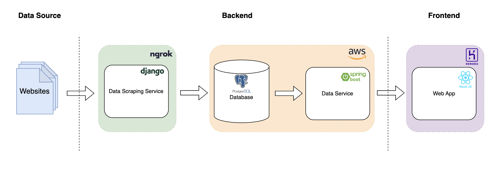

# Nutrilyfe
An industry project completed as part of a university unit (FIT3170) for AMILI. This project is a data scraping and mining solution consisting of two microservices on the backend and a web application on the frontend.

## Backend
### Data Scraping Service
A data scraping and mining service developed using Python (Django) to collect and process data from various sources to extract key information using NER for data ingestion into a PostgreSQL database hosted on AWS RDS. 

Libraries used: Beautiful Soup, spaCy.

### Data Service
A data service developed using Spring Boot to interface with the database, hosted on AWS Elastic Beanstalk.

## Frontend
The web app was developed using React to demonstrate and present data to the client. Hosted on Heroku.

## Note
Due to the confidential nature of this project, I am unable to disclose the data sources used nor the nature of the data itself.
